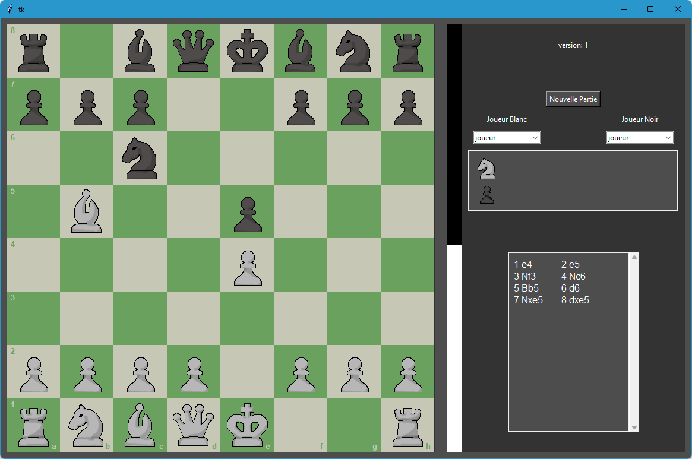

# Jeu D'echec en Python

Voici un projet personnel codé en python. 
C'est une interface de jeu d'echec avec quelque bot.

# Fonctionnalite
Vous pouvez lancer une partie :
* humain vs humain
* humain vs bot coup aleatoire
* humain vs bot algorithme minmax
* humain vs bot  stockfish
* bot vs bot

Vous pouvez jouer les pieces blanches comme les pieces noirs. 
Vous pouvez selectionner une piece en cliquand dessus puis cliquer sur la case d'arriver.  
Vous pouvez aussi jouer un coup en drag and drop. 
Vous pouvez retourner l'echequier à tout moment. 
Vous pouvez cliquer sur les coups jouer pour les revoirs. 
Le moteur gere tous les coups possibles tel que le roc, la prise en passant ou la promotion.

# Installation
1. Vous devrez Télécharger stockfish ici https://stockfishchess.org/download/
   
2. Puis place le fichier téléchargé dans le dossier "src".
  
3. Puis installer le module python stockfish sur votre ordinateur. Avec la commande : "pip install stockfish"
Disponible ici https://pypi.org/project/stockfish/
